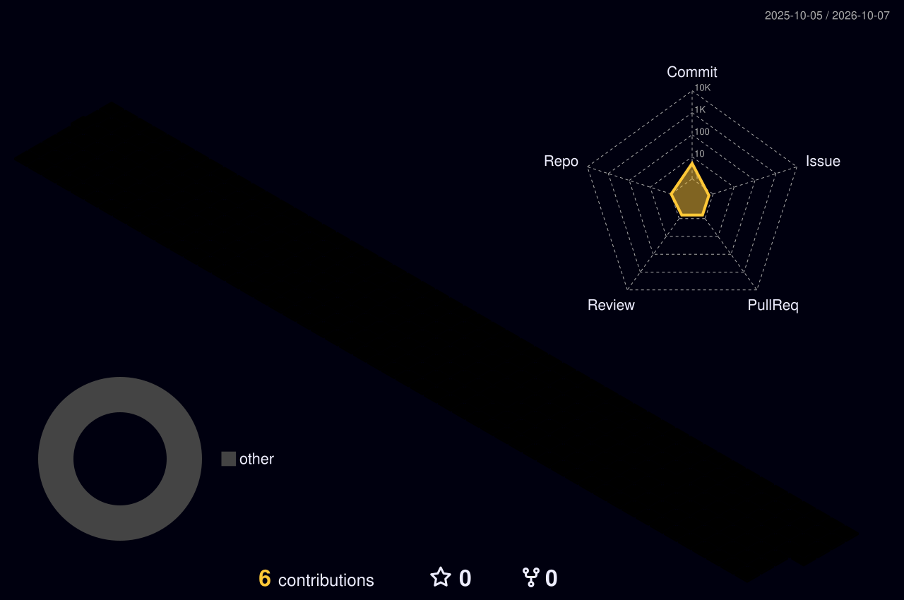

<!-- Animated gradient header -->

  

<!-- Typing animation -->

  

  
  
  

---

## 👩‍💻 About me

I design and ship **enterprise-grade, self-healing infrastructure** for Fortune 500 clients, and I'm pushing DevOps into its next era with **AI-integrated pipelines, autonomous code review and LLM agent-based automation**.

Beyond engineering, I work in **pre-sales, proposals and GTM**, designing cloud architectures (including **GCP**) for large enterprises, and I enjoy teaching and **speaking** (🎤 Confluent Meetup).

- 🏗️ Multi-region, highly available **Kubernetes** platforms (99.99% uptime SLA)
- 🤖 **AI-powered CI/CD** with Google Code Assist: auto review, auto-correction, compliance-gated merging
- 🔒 **DevSecOps** products that block vulnerable code before it merges
- 📊 Full-stack **observability** (Prometheus, Grafana, ELK, OpenTelemetry)
- 🧠 Building an **LLM agent-based internal launchpad** for everyday DevOps workflows
- ✍️ 10+ technical articles · 40+ engineers trained · 🎤 Meetup speaker

---

## 🌌 My contribution universe (3D)

  

---

## 🧰 Tech stack

  

<b>More tools</b>

`Helm` · `OpenTelemetry` · `Datadog` · `ELK` · `CloudFormation` · `ScyllaDB` · `Buildpiper` · `Google Code Assist` · `Prompt Engineering` · `LLM Agents`

---

## 🏆 Impact by the numbers

  
  
  
  
  
  
  

---

## 📈 GitHub stats

  
  

  

---

## 📌 Featured work

| Project | What it does |
|---|---|
| 🤖 **AI CI/CD Pipeline** | Autonomous code review and compliance-gated merging with Google Code Assist |
| 🔒 **DevSecOps Gate** | Commit-level vulnerability scanning with remediation suggestions |
| 🧠 **LLM Launchpad** | Agentic AI for DevOps workflows and incident response |
| ☁️ **GCP Reference Architecture** | Scalable, low-downtime architecture patterns (sanitized demo) |

> Add links to your public repos here once they're pushed.

---

## ✍️ Writing & talks

- 🎤 **Confluent Meetup:** *[talk title]* ([slides / recording](#))
- 📝 Articles: *[link 1]* · *[link 2]* · *[link 3]*

---

## 🤝 Let's connect

I'm open to **Solutions Architect, Developer Advocate and DevRel** roles, and to freelance technical content and architecture consulting.

  

