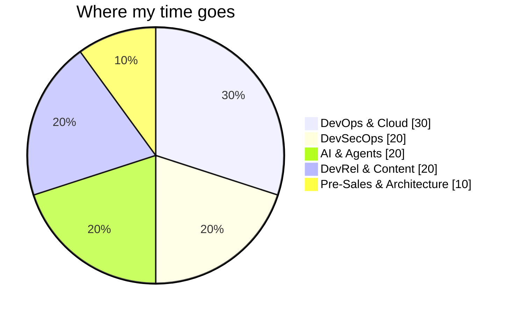
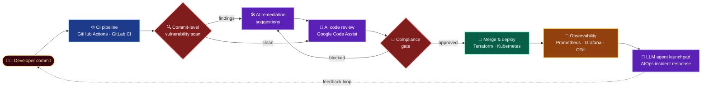
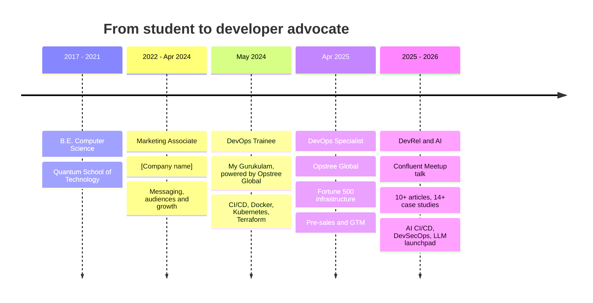

<!-- Header banner -->
<p align="center">
  
</p>

<h1 align="center">Hi, I'm Komal Jaiswal 👋</h1>

<h3 align="center"><em>DevOps Specialist · Developer Relations Engineer · Product Engineer</em></h3>
<h4 align="center"><em>Building secure, AI-assisted software delivery, and teaching how it works.</em></h4>

<p align="center">
  <code>DevOps</code> • <code>DevSecOps</code> • <code>DevRel</code> • <code>AI Agents</code> • <code>Kubernetes</code> • <code>GCP</code> • <code>AWS</code> • <code>Terraform</code> • <code>Observability</code>
</p>

<!-- Typing animation -->
<p align="center">
  <a href="https://github.com/komalthakur853">
    
  </a>
</p>

<p align="center">
  <a href="https://www.linkedin.com/in/komaljaiswal999/"></a>
  <a href="https://github.com/komalthakur853?tab=followers"></a>
  
</p>

<p align="center">
  
  
</p>

---

<!-- ============================ ABOUT ============================ -->


<table>
<tr>
<td width="62%" valign="top">

I'm an **engineer-turned-developer-advocate** who builds and teaches **secure, AI-assisted software delivery**.

I design and ship **enterprise-grade, self-healing infrastructure** for Fortune 500 clients, then turn what I learn into **talks, tutorials, workshops, case studies and working demos** other engineers can actually use.

I'm also **customer-facing by background**: technical discovery, demos, proofs of concept and proposals for **Aditya Birla, Zee and NeGD** (INR 20 Crore combined deal value).

```yaml
name:        Komal Jaiswal
role:        DevOps Specialist | Developer Relations Engineer | Product Engineer
company:     Opstree Global
focus:       [DevSecOps, AI-assisted CI/CD, LLM agents, Kubernetes, Observability]
speaking:    Confluent Meetup · "Summary Culture Killing Us"
writing:     10+ articles · 14+ case studies
teaching:    40+ engineers · 95% satisfaction · 85% cert pass rate
open_source: OT-Kit (Terraform)
currently:   building an LLM agent-based internal launchpad
```

</td>
<td width="38%" valign="top" align="center">



</td>
</tr>
</table>

### ⚡ What I'm known for

| 🔐 DevSecOps | 🤖 AI-assisted CI/CD | 🧠 LLM Agents | ☸️ Resilient Platforms |
|:--:|:--:|:--:|:--:|
| Scans **every commit**, suggests fixes, **blocks insecure merges** | Google Code Assist for AI review, corrections and compliance-gated merging | Internal launchpad applying **AIOps / MLOps** to incident response | Multi-region Kubernetes with **99.99% uptime SLA** |

| 📡 Observability | 🎤 Speaking | ✍️ Writing | 🎓 Teaching |
|:--:|:--:|:--:|:--:|
| Prometheus, Grafana, ELK, OpenTelemetry. **MTTR −80%** | **Confluent Meetup** speaker | **10+ articles**, **14+ case studies** | **40+ engineers** trained |

<!-- ============================ NUMBERS ============================ -->


<p align="center">
  
  
  
  
  
  
  
  
  
  
  
  
  
  
</p>

<!-- ============================ 3D GRAPH ============================ -->


<p align="center">
  
</p>

<!-- ============================ TECH STACK ============================ -->


<p align="center">
  
  <br>
  
</p>

<details open>
<summary><b>☁️ &nbsp;Cloud, Containers &amp; Infrastructure as Code</b></summary>
<br>


`GKE` · `EKS` · `AKS` · `EC2` · `S3` · `RDS` · `Lambda` · `VPC` · `IAM` · `ECS` · `Auto Scaling` · `CloudWatch` · `Azure VMs` · `App Service` · `Multi-Region DR` · `Pod Autoscaling` · `Cluster Administration` · `Load Balancing` · `High Availability`
</details>

<details open>
<summary><b>🔁 &nbsp;CI/CD &amp; Automation</b></summary>
<br>


`Pipeline as Code` · `Automated Testing` · `Merge Workflows` · `Sub-minute Deployments` · `Hybrid Cloud` · `Code Review Automation`
</details>

<details open>
<summary><b>🤖 &nbsp;AI, Agents &amp; AIOps</b></summary>
<br>


`AI-Assisted Code Review` · `Auto-Remediation` · `Incident Response Automation` · `AI-Assisted DevOps`
</details>

<details open>
<summary><b>🔐 &nbsp;Security (DevSecOps)</b></summary>
<br>


`Vulnerability Scanning & Triage` · `Remediation Suggestions` · `Compliance Gates` · `Secure Development Workflows` · `Banking & Financial Security`
</details>

<details open>
<summary><b>📡 &nbsp;Observability</b></summary>
<br>


`Distributed Tracing` · `Alerting` · `Log Aggregation` · `SLO / SLA Monitoring`
</details>

<details open>
<summary><b>🎤 &nbsp;Developer Relations Toolkit</b></summary>
<br>


`Tutorials` · `Case Studies` · `Developer Education` · `Mentoring` · `Developer Feedback & Friction Analysis` · `Pre-Sales & GTM` · `Technical Proposals` · `Proofs of Concept` · `Customer Consultation` · `Stakeholder Management`
</details>

<details open>
<summary><b>💻 &nbsp;Programming &amp; Systems</b></summary>
<br>


`YAML` · `JSON` · `REST APIs` · `GitHub` · `GitLab` · `Ubuntu` · `CentOS` · `RedHat` · `VPC Design`
</details>

<!-- ============================ ARCHITECTURE ============================ -->




<!-- ============================ FEATURED WORK ============================ -->


| | Project | What it does | Stack |
|:-:|---|---|---|
| 🔐 | **DevSecOps Compliance Product** | Scans every commit, generates remediation suggestions, blocks insecure code via mandatory compliance gates | `GitLab CI/CD` `SAST` `Python` |
| 🤖 | **AI-Powered CI/CD Pipeline** | Automated testing, AI code review, suggested corrections and compliance-gated merging; removes review bottlenecks | `Google Code Assist` `GitLab CI/CD` `Python` |
| 🧠 | **LLM Agent-Based Launchpad** | Agentic platform for monitoring, incident response and deployments using AIOps/MLOps principles | `LLM Agents` `Python` `Kubernetes` |
| ☁️ | **Zee Bulletin GCP Architecture** | Designed and scaled GCP architecture for a high-traffic media platform with reduced downtime | `GCP` `Kubernetes` `Terraform` |
| 🏦 | **Banking Application PII Security** | Secured PII data handling with access controls and sensitive-data protection | `IAM` `Encryption` `Audit` |
| 📡 | **Enterprise Observability Platform** | Incident detection time −70%, MTTR −80% across multiple Fortune 500 clients | `Prometheus` `Grafana` `ELK` `OTel` |
| ☸️ | **Multi-Region HA Kubernetes** | Disaster-recovery-ready clusters for DP World and Maximore at 99.99% uptime SLA | `Kubernetes` `Helm` `Terraform` |
| 🌱 | **OT-Kit Terraform (OSS)** | Community support and contribution to Opstree's open-source Terraform modules | `Terraform` |

> 🔗 *Add repo links to each row once the sanitized versions are public.*

<!-- ============================ JOURNEY ============================ -->




| Period | Role | Company |
|:--|:--|:--|
| **Apr 2025 – Present** | DevOps Specialist (DevRel, DevSecOps, Pre-Sales) | Opstree Global, Noida |
| **May 2024 – Apr 2025** | DevOps Trainee | My Gurukulam, powered by Opstree Global, Noida |
| **2022 – Apr 2024** | Marketing Associate | [Company name] |
| **2017 – 2021** | B.E. Computer Science | Quantum School of Technology |

> 💡 My marketing background is why I'm good at DevRel: I know how to find an audience, shape a message and explain technical work in a way people actually want to read.

**Highlights:** 🥇 Top Performer among 40+ engineers · 🏗️ 5+ end-to-end Fortune 500 deployments · 🔁 CI/CD for 10+ microservices across hybrid cloud · 💰 30% annual infra cost reduction

<!-- ============================ WRITING & TALKS ============================ -->


| 🎤 Talks | 📝 Articles | 📚 Case Studies | 🌱 Open Source |
|:--:|:--:|:--:|:--:|
| **Confluent Meetup**<br/>*Summary Culture Killing Us*<br/>[slides / recording](#) | **10+ articles**<br/>CI/CD · Kubernetes · Observability · AI DevOps<br/>[read them](#) | **14+ case studies**<br/>Enterprise infrastructure engagements<br/>[browse](#) | **OT-Kit**<br/>Terraform community contributions<br/>[repo](https://github.com/OT-CONTAINER-KIT) |

🎓 **Teaching:** designed a Kubernetes, AWS, Terraform and CI/CD curriculum for **40+ engineers** (95% satisfaction, 85% certification pass rate) · 📬 **Substack:** [add link](#)

<!-- ============================ STATS ============================ -->


<p align="center">
  
  
</p>

<p align="center">
  
</p>

<p align="center">
  
</p>

<p align="center">
  
</p>

<!-- Optional: contribution snake. Needs a GitHub Action (Platane/snk) to generate the SVGs, then uncomment.
<p align="center">
  
</p>
-->

<!-- ============================ CONNECT ============================ -->


I'm open to **Developer Relations, Developer Advocate, DevOps, Solutions Architect and Product Engineer** roles, plus freelance technical content, talks, workshops and architecture consulting.

> 💬 **Ask me about:** DevSecOps gates · AI code review in CI/CD · LLM agents for ops · Kubernetes DR · observability · writing and speaking about infrastructure.

<p align="center">
  <a href="https://www.linkedin.com/in/komaljaiswal999/"></a>
  <a href="mailto:komaljaiswal853@gmail.com"></a>
  <a href="https://github.com/komalthakur853"></a>
</p>.


