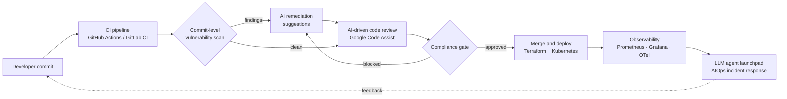

<!-- Header banner -->

  

<h1 align="center">Hi, I'm Komal Jaiswal 👋</h1>

<h3 align="center"><em>DevOps Specialist · Developer Relations Engineer · Product Engineer</em></h3>
<h4 align="center"><em>Building secure, AI-assisted software delivery, and teaching how it works.</em></h4>

  <code>DevOps</code> • <code>DevSecOps</code> • <code>DevRel</code> • <code>AI Agents</code> • <code>Kubernetes</code> • <code>GCP</code> • <code>AWS</code> • <code>Terraform</code> • <code>Observability</code>

<!-- Typing animation -->

  

  
  
  

  
  

---

## 👩‍💻 About me

I'm an **engineer-turned-developer-advocate** with 2+ years of experience building and teaching **secure, AI-assisted software delivery**. I design and ship enterprise-grade, self-healing infrastructure for Fortune 500 clients, and I turn what I learn into **talks, tutorials, workshops, case studies and working demos** that other engineers can use.

I'm also **customer-facing by background**: I've run technical discovery, built demos and proofs of concept, and written proposals for enterprise accounts like **Aditya Birla, Zee and NeGD** (INR 20 Crore combined deal value).

- 🔐 **DevSecOps** product that scans every commit, suggests fixes and **blocks insecure code behind mandatory compliance gates**
- 🤖 **AI-integrated CI/CD** with Google Code Assist: AI code review, suggested corrections, compliance-gated merging
- 🧠 **LLM agent-based internal launchpad** applying AIOps/MLOps to monitoring, incident response and deployments
- ☸️ Multi-region, highly available **Kubernetes** platforms sustaining a **99.99% uptime SLA** (DP World, Maximore)
- 📡 Full-stack **observability** (Prometheus, Grafana, ELK, OpenTelemetry) that cut MTTR by 80%
- 🎤 Speaker at **Confluent Meetup** · ✍️ 10+ articles · 14+ case studies · 🎓 trained 40+ engineers (95% satisfaction)
- 🌱 Community contributor to **Terraform modules of OT-Kit** (Opstree)

---

## 🌌 My contribution universe (3D)

  

---

## 🏆 Impact by the numbers

  
  
  
  
  
  
  
  
  
  
  

---

## 🧰 Tech stack

  

<b>☁️ Cloud, containers and IaC</b>

 

`EC2` · `S3` · `RDS` · `Lambda` · `VPC` · `IAM` · `ECS` · `Auto Scaling` · `CloudWatch` · `Azure VMs` · `App Service` · `Multi-region DR` · `Pod Autoscaling` · `Load Balancing`

<b>🔁 CI/CD, GitOps and automation</b>

 

`Pipeline as Code` · `Automated Testing` · `Merge Workflows` · `Sub-minute Deployments` · `Hybrid Cloud`

<b>🤖 AI, agents and AIOps</b>

 

`AI-assisted code review` · `Auto-remediation` · `Incident response automation`

<b>🔐 Security (DevSecOps)</b>

 

`Vulnerability Scanning and Triage` · `SAST` · `Remediation Suggestions` · `Compliance Gates` · `PII Data Protection` · `IAM and Least Privilege` · `Secrets Management` · `SSL/TLS` · `Banking and Financial Security`

<b>📡 Observability</b>

 

`Distributed Tracing` · `Alerting` · `Log Aggregation` · `SLO/SLA Monitoring`

<b>🎤 Developer Relations toolkit</b>

 

`Tutorials` · `Case Studies` · `Developer Education` · `Mentoring` · `Community Engagement` · `Developer Feedback and Friction Analysis` · `Pre-Sales and GTM` · `Technical Proposals` · `Proofs of Concept` · `Stakeholder Management`

<b>💻 Programming and systems</b>

 

`YAML` · `JSON` · `REST APIs` · `Git` · `GitHub` · `GitLab` · `Ubuntu` · `CentOS` · `RedHat` · `VPC Design` · `High Availability Architecture`

---

## 🧭 How I think about secure, AI-assisted delivery

---

## 📌 Featured work

| Project | What it does | Stack |
|---|---|---|
| 🔐 **DevSecOps Compliance Product** | Scans every commit, generates remediation suggestions and blocks insecure code through mandatory compliance gates | GitLab CI/CD, SAST, Python |
| 🤖 **AI-Powered CI/CD Pipeline** | Automated testing, AI code review, suggested corrections and compliance-gated merging that removes review bottlenecks | Google Code Assist, GitLab CI/CD, Python |
| 🧠 **LLM Agent-Based Internal Launchpad** | Agentic platform for monitoring, incident response and deployments using AIOps/MLOps principles | LLM Agents, Python, Kubernetes |
| ☁️ **Zee Bulletin GCP Architecture** | Designed and scaled the GCP architecture for a high-traffic media platform with reduced downtime | GCP, Kubernetes, Terraform |
| 🏦 **Banking Application PII Security** | Secured PII data handling with access controls and protection of sensitive data | IAM, encryption, audit controls |
| 📡 **Enterprise Observability Platform** | Cut incident detection time by 70% and MTTR by 80% across multiple Fortune 500 clients | Prometheus, Grafana, ELK, OpenTelemetry |
| ☸️ **Multi-Region HA Kubernetes** | Disaster-recovery-ready clusters sustaining a 99.99% uptime SLA for DP World and Maximore | Kubernetes, Helm, Terraform |
| 🌱 **OT-Kit Terraform (OSS)** | Community support and contribution to Opstree's open-source Terraform modules | Terraform |

> 🔗 Add repo links to each row once the public/sanitized versions are pushed.

---

## 💼 Experience

| Role | Where | When |
|---|---|---|
| **DevOps Specialist** (Developer Relations, DevSecOps, Pre-Sales) | Opstree Global, Noida | Apr 2025 – Present |
| **DevOps Trainee** | My Gurukulam, powered by Opstree Global, Noida | May 2024 – Apr 2025 |

**Highlights:** Top Performer among 40+ engineers · 5+ end-to-end Fortune 500 infrastructure deployments · 10+ microservices shipped via CI/CD across hybrid cloud · 30% annual infra cost reduction · 25% AWS throughput gain and 20% compute cost cut

🎓 **B.E. Computer Science**, Quantum School of Technology (2017 – 2021)

---

## ✍️ Writing, talks and community

- 🎤 **Confluent Meetup:** *Summary Culture Killing Us* ([slides / recording](#))
- 📝 **Articles (10+):** [link 1](#) · [link 2](#) · [link 3](#), covering CI/CD, Kubernetes, observability and AI-powered DevOps
- 📚 **Case studies (14+):** infrastructure case studies from enterprise engagements ([browse](#))
- 🎓 **Training:** designed a Kubernetes, AWS, Terraform and CI/CD curriculum for 40+ engineers (95% satisfaction, 85% certification pass rate)
- 🌱 **Open source:** contributions to [OT-Kit](https://github.com/OT-CONTAINER-KIT) (Terraform) <!-- confirm the exact repo URL -->
- 📬 **Substack:** [add link](#)

---

## 📈 GitHub stats

  
  

  

---

## 🤝 Let's connect

I'm open to **Developer Relations, Developer Advocate, DevOps, Solutions Architect and Product Engineer** roles, plus freelance technical content, talks, workshops and architecture consulting.

**Ask me about:** DevSecOps gates · AI code review in CI/CD · LLM agents for ops · Kubernetes DR · observability · writing and speaking about infra.

  
  

